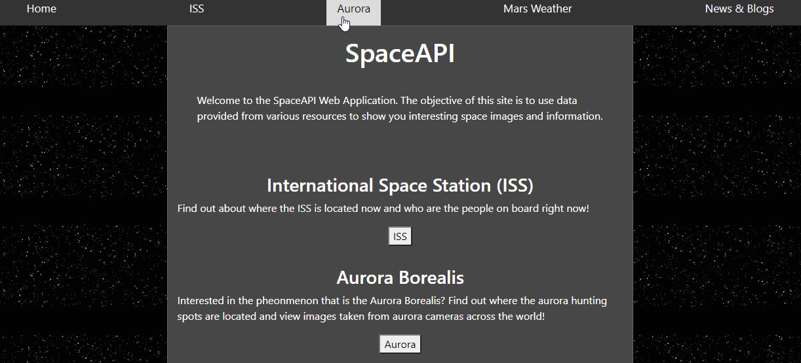

# SpaceAPI WebApp
Personal Project built with the Flask framework, HTML, and CSS. The application is a web app that fetches information from various API's containing information and data about space, parses through the data and displays it on the site. There is interactivity involved such as using buttons or forms to have the user choose which data they want to see. 

# Concepts Applied
The key concepts used in the project are:
- Using the requests library to fetch information from API's.
- Parsing through JSON data 
- Downloading image data from API's
- Template & template inheritance
- HTML and CSS design
- Integrating with Bootstrap

# Key Features
- See information about International Space Station including how many people are on it and who they are. 
- Information on the Aurora Borealis, including information where borealis hunting spots are located.
- Access Images from Auroras.live API including aurora cameras and satellite images. 

# Demo

# Features to be Implemented
- Using Google Maps API to show the current exact location of the International Space Station.
- Use API to fetch data about weather on different planets.
- Create a page that compiles information about blogs and articles related to space. 

# API References
   
http://api.open-notify.org/astros.json
http://api.open-notify.org/iss-now.json
https://maas2.apollorion.com/
https://api.spaceflightnewsapi.net/v3/documentation
https://api.nasa.gov/
